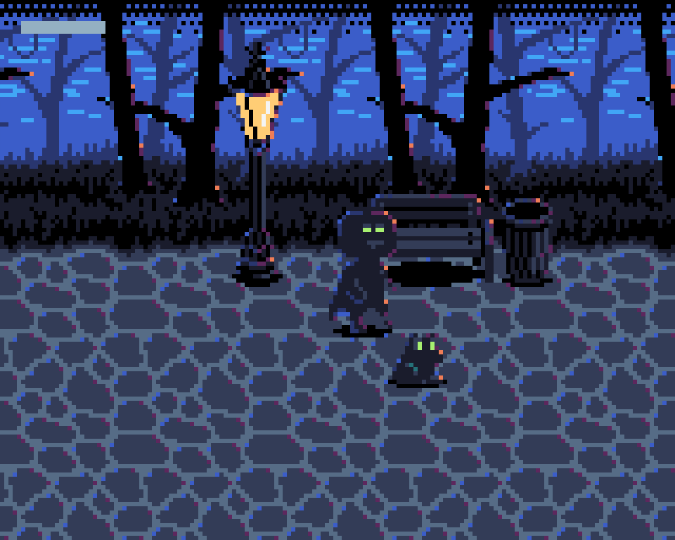

# Sombervale

Made in 7 days for [Rusty Jam](https://itch.io/jam/rusty-jam) 2021.

## About

It is dark and spooky in Sombervale park. There are shadow creatures all around you. Run away with <kbd>W</kbd> <kbd>A</kbd> <kbd>S</kbd> <kbd>D</kbd>.

Your only defense is an imaginary frog that can be summoned with <kbd>space</kbd>. But be careful! You can only summon a frog once every 3 seconds.

When a frog and shadow creature collide, they will annihilate each other. The more shadow creatures you defeat with frogs, the more frogs you will be able to summon.

## Development

- [Design document](https://docs.google.com/document/d/1BKp-P05siMCP8Wghgyq5JWHpdYwhqHKvGEM1hcASWTA/edit?usp=sharing)

Tools used:

- [GIMP](https://gimp.org/)
- [Tiled](https://mapeditor.org/)
- [Audacity](https://www.audacityteam.org/)
- [jsfxr](https://sfxr.me/)
